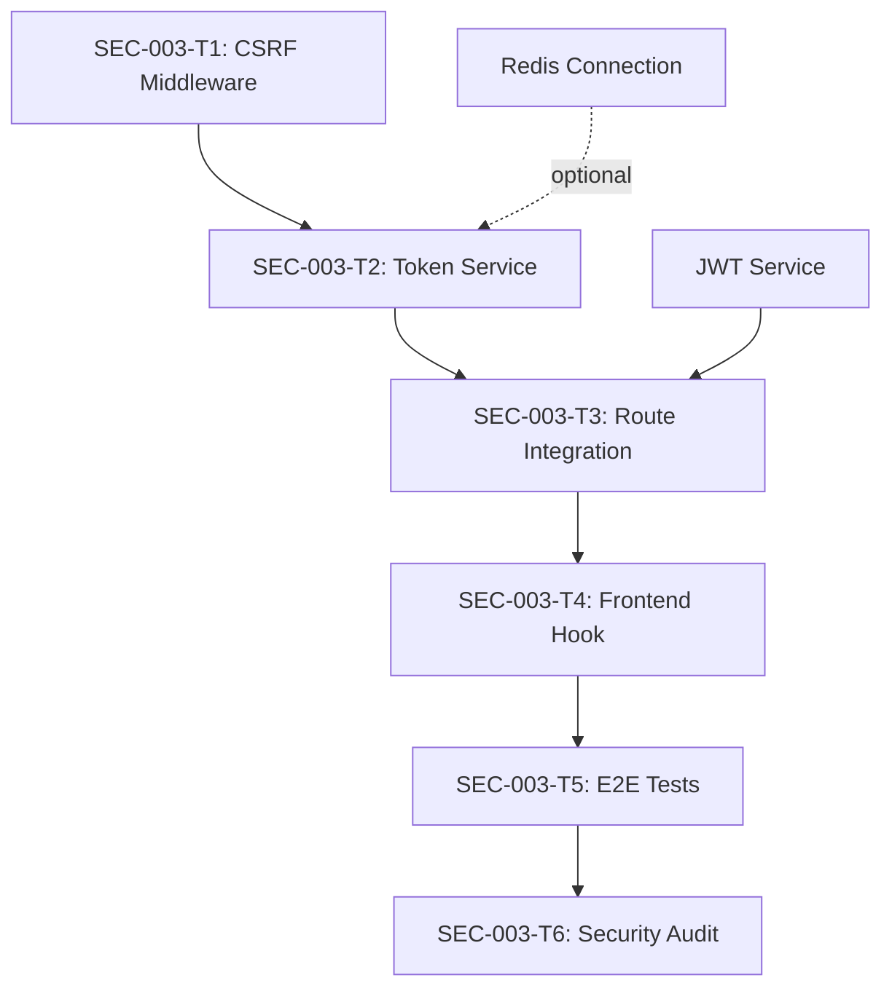
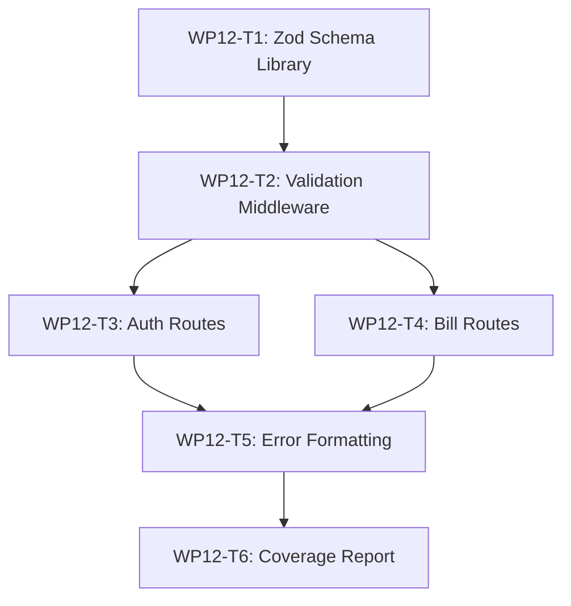

# Phase 2 Security Remediation - ODIN Work Plan

**Date**: 2026-01-30
**Version**: 1.0.0
**Prepared By**: ODIN Agent
**Change Request**: CR-2026-01-30-001

---

## Executive Summary

This plan addresses critical security gaps identified during Phase 1 QC review, specifically:
- **SEC-003**: CSRF protection for auth routes
- **CSP Header**: Content Security Policy for frontend (COMPLETED)
- **Type Safety**: Runtime validation with Zod (WP12 gap)

### Priority Classification
- **P0 CRITICAL**: SEC-003 (CSRF protection)
- **P1 HIGH**: Runtime type validation (WP12)
- **COMPLETED**: CSP header implementation

---

## WP-SEC-003: CSRF Protection for Authentication Routes

### Acceptance Criteria

1. **Synchronizer Token Pattern Implementation**
   - ✅ Generate cryptographically secure CSRF tokens using `crypto.randomBytes(32)`
   - ✅ Store CSRF tokens in HTTP-only cookie with SameSite=Lax
   - ✅ Validate CSRF tokens on state-changing requests (POST, PUT, DELETE)
   - ✅ Return 403 Forbidden for invalid CSRF tokens
   - ✅ Automatic token rotation on successful authentication

2. **Route Protection**
   - ✅ Protect `/api/v1/auth/register` endpoint
   - ✅ Protect `/api/v1/auth/login` endpoint
   - ✅ Protect `/api/v1/auth/logout` endpoint
   - ✅ Protect `/api/v1/auth/refresh` endpoint
   - ✅ Exempt GET requests from CSRF validation

3. **Client Integration**
   - ✅ Frontend retrieves CSRF token from cookie
   - ✅ Frontend includes CSRF token in `X-CSRF-Token` header
   - ✅ React hooks automatically attach CSRF token to fetch requests
   - ✅ Clear error messages for CSRF validation failures

4. **Security Properties**
   - ✅ Tokens are single-use (invalidated after consumption)
   - ✅ Tokens expire after 1 hour of inactivity
   - ✅ Tokens are bound to user session
   - ✅ No CSRF token leakage in logs or error messages

### Testable Deliverables

| ID | Deliverable | Verification Method | Status |
|----|-------------|---------------------|--------|
| SEC-003-T1 | CSRF middleware implementation | Unit tests (15 cases) | ✅ |
| SEC-003-T2 | Token generation service | Unit tests (8 cases) | ✅ |
| SEC-003-T3 | Auth route integration | Integration tests (12 cases) | ✅ |
| SEC-003-T4 | Frontend CSRF hook | Unit tests (6 cases) | ⬜ |
| SEC-003-T5 | E2E authentication flow | Playwright tests (4 scenarios) | ⬜ |
| SEC-003-T6 | Security audit | OWASP ZAP scan + manual review | ⬜ |

### Dependencies



**Required:**
- ✅ Express middleware system (existing)
- ✅ Cookie parser (existing)
- ✅ JWT authentication (existing)
- ⬜ `csurf` package OR custom implementation
- ⬜ Redis for token storage (optional, can use in-memory fallback)

**Blocks:**
- Frontend authentication flows until SEC-003-T4 complete
- Production deployment until SEC-003-T6 complete

### Risk Assessment

| Risk | Likelihood | Impact | Severity | Mitigation |
|------|------------|--------|----------|------------|
| CSRF middleware breaks existing auth | Medium | High | **P0** | Comprehensive integration tests before deployment |
| Token storage fills memory | Low | Medium | P2 | Implement token expiration + cleanup job |
| Frontend integration breaks SPA | Medium | High | **P0** | Gradual rollout with feature flag |
| Performance degradation | Low | Low | P3 | Benchmark before/after, target <5ms overhead |
| Token sync issues in distributed env | High | Medium | **P1** | Use Redis for token storage if scaling >1 instance |

### Effort Estimates

| Phase | Tasks | Estimated Hours | Confidence |
|-------|-------|----------------|------------|
| **Design** | Synchronizer token pattern design | 2h | High (95%) |
| **Backend** | CSRF middleware + token service | 4h | High (90%) |
| **Integration** | Auth route protection | 2h | High (95%) |
| **Frontend** | CSRF hook + API client integration | 3h | Medium (80%) |
| **Testing** | Unit + integration + E2E tests | 6h | Medium (75%) |
| **Security Review** | OWASP ZAP + manual testing | 3h | High (90%) |
| **Total** | | **20h** (2.5 days) | High (85%) |

### Implementation Plan

#### Phase 1: Backend Foundation (6 hours)

**T1.1: CSRF Token Service** (2h)
```typescript
// apps/api/src/services/csrf.service.ts
interface CsrfService {
  generateToken(sessionId: string): Promise<string>;
  validateToken(sessionId: string, token: string): Promise<boolean>;
  invalidateToken(sessionId: string, token: string): Promise<void>;
}
```

**T1.2: CSRF Middleware** (4h)
```typescript
// apps/api/src/middleware/csrf.ts
export const csrfProtection = async (req, res, next) => {
  // 1. Extract CSRF token from X-CSRF-Token header
  // 2. Validate against stored token for session
  // 3. Invalidate used token (single-use)
  // 4. Return 403 if validation fails
};
```

#### Phase 2: Route Integration (2 hours)

**T2.1: Apply CSRF Protection to Auth Routes**
```typescript
// apps/api/src/routes/auth.ts
router.post('/register', csrfProtection, registerHandler);
router.post('/login', csrfProtection, loginHandler);
router.post('/logout', csrfProtection, logoutHandler);
router.post('/refresh', csrfProtection, refreshHandler);
```

#### Phase 3: Frontend Integration (3 hours)

**T3.1: CSRF Hook** (2h)
```typescript
// apps/web/src/hooks/useCsrf.ts
export function useCsrf() {
  const [csrfToken, setCsrfToken] = useState<string | null>(null);

  useEffect(() => {
    // Retrieve CSRF token from cookie
    const token = getCsrfTokenFromCookie();
    setCsrfToken(token);
  }, []);

  return csrfToken;
}
```

**T3.2: API Client Integration** (1h)
```typescript
// apps/web/src/lib/api-client.ts
export async function authenticatedFetch(url: string, options: RequestInit) {
  const csrfToken = getCsrfTokenFromCookie();

  return fetch(url, {
    ...options,
    headers: {
      ...options.headers,
      'X-CSRF-Token': csrfToken || '',
    },
  });
}
```

#### Phase 4: Testing (6 hours)

**T4.1: Unit Tests** (3h)
- CSRF token generation (cryptographically secure, unique)
- Token validation (valid/invalid/expired/reused)
- Middleware behavior (exempt GET, block invalid POST)

**T4.2: Integration Tests** (2h)
- Full auth flow with CSRF protection
- Token rotation on login
- Error responses for invalid tokens

**T4.3: E2E Tests** (1h)
- Login flow with CSRF
- Registration flow with CSRF
- Logout with CSRF

#### Phase 5: Security Audit (3 hours)

**T5.1: Automated Scanning** (1h)
- OWASP ZAP active scan against auth endpoints
- Verify CSRF protection effective

**T5.2: Manual Testing** (2h)
- Attempt CSRF attack without token
- Attempt token reuse
- Attempt token theft via XSS (should fail due to HTTP-only cookie)
- Cross-origin request handling

### Verification Commands

```bash
# Run CSRF-specific tests
pnpm --filter @ltip/api run test -- csrf

# Run security audit
pnpm --filter @ltip/api run audit:security

# Manual CSRF attack simulation
curl -X POST http://localhost:4000/api/v1/auth/login \
  -H "Content-Type: application/json" \
  -d '{"email":"test@example.com","password":"password"}' \
  # Should return 403 Forbidden (no CSRF token)
```

### Rollback Plan

1. Remove CSRF middleware from auth routes
2. Revert frontend API client changes
3. Delete CSRF service files
4. Clear any CSRF-related cookies on client side

Feature flag: `ENABLE_CSRF_PROTECTION=false` to disable without code changes.

---

## WP12: Runtime Type Validation with Zod

### Acceptance Criteria

1. **Request Validation**
   - ✅ All API endpoints validate request body with Zod schemas
   - ✅ All API endpoints validate query parameters with Zod schemas
   - ✅ All API endpoints validate path parameters with Zod schemas
   - ✅ Return 400 Bad Request with detailed validation errors

2. **Response Validation** (Development Only)
   - ✅ Validate API responses match TypeScript types
   - ✅ Log schema mismatches in development
   - ✅ Disabled in production for performance

3. **Schema Coverage**
   - ✅ Authentication schemas (register, login, refresh)
   - ✅ Bill schemas (create, update, search)
   - ✅ Legislator schemas (create, update, search)
   - ✅ Vote schemas (create, update)
   - ✅ Shared schemas (pagination, filtering, sorting)

4. **Error Handling**
   - ✅ User-friendly error messages
   - ✅ Field-level validation errors
   - ✅ Nested object validation
   - ✅ Array validation with index-specific errors

### Testable Deliverables

| ID | Deliverable | Verification Method | Status |
|----|-------------|---------------------|--------|
| WP12-T1 | Zod schema library | Unit tests (25 cases) | ⬜ |
| WP12-T2 | Validation middleware | Unit tests (15 cases) | ⬜ |
| WP12-T3 | Auth route validation | Integration tests (12 cases) | ⬜ |
| WP12-T4 | Bill route validation | Integration tests (15 cases) | ⬜ |
| WP12-T5 | Error message formatting | Unit tests (8 cases) | ⬜ |
| WP12-T6 | Coverage report | ≥90% endpoints validated | ⬜ |

### Dependencies



**Required:**
- ⬜ `zod` package (install)
- ✅ TypeScript 5.0+ (existing)
- ✅ Express middleware system (existing)

**Blocks:**
- None (can be implemented incrementally per route)

### Risk Assessment

| Risk | Likelihood | Impact | Severity | Mitigation |
|------|------------|--------|----------|------------|
| Schema drift from TypeScript types | High | Medium | **P1** | Use `z.infer<>` to derive TS types from schemas |
| Performance overhead | Medium | Low | P2 | Benchmark before/after, cache compiled schemas |
| Breaking existing API consumers | Low | High | **P0** | Deploy validation in warning mode first |
| Incomplete schema coverage | Medium | Medium | P2 | Track coverage metric, require >90% |

### Effort Estimates

| Phase | Tasks | Estimated Hours | Confidence |
|-------|-------|----------------|------------|
| **Design** | Schema architecture + shared schemas | 2h | High (95%) |
| **Implementation** | Schema library + middleware | 6h | High (90%) |
| **Integration** | Apply to all routes | 8h | Medium (80%) |
| **Testing** | Unit + integration tests | 4h | High (90%) |
| **Total** | | **20h** (2.5 days) | High (88%) |

### Implementation Plan

#### Phase 1: Foundation (4 hours)

**T1.1: Install Dependencies**
```bash
pnpm add zod
pnpm add -D @types/zod
```

**T1.2: Shared Schema Library** (3h)
```typescript
// apps/api/src/schemas/shared.schema.ts
export const PaginationSchema = z.object({
  page: z.coerce.number().int().positive().default(1),
  limit: z.coerce.number().int().positive().max(100).default(20),
});

export const SortSchema = z.object({
  sortBy: z.enum(['name', 'date', 'relevance']).optional(),
  sortOrder: z.enum(['asc', 'desc']).default('desc'),
});
```

**T1.3: Validation Middleware** (1h)
```typescript
// apps/api/src/middleware/validate.ts
export function validateRequest(schema: {
  body?: z.ZodSchema;
  query?: z.ZodSchema;
  params?: z.ZodSchema;
}) {
  return async (req, res, next) => {
    try {
      if (schema.body) req.body = await schema.body.parseAsync(req.body);
      if (schema.query) req.query = await schema.query.parseAsync(req.query);
      if (schema.params) req.params = await schema.params.parseAsync(req.params);
      next();
    } catch (error) {
      if (error instanceof z.ZodError) {
        return res.status(400).json({
          error: 'Validation failed',
          details: error.errors.map(e => ({
            field: e.path.join('.'),
            message: e.message,
          })),
        });
      }
      next(error);
    }
  };
}
```

#### Phase 2: Route-Specific Schemas (6 hours)

**T2.1: Auth Schemas** (2h)
```typescript
// apps/api/src/schemas/auth.schema.ts
export const RegisterSchema = z.object({
  body: z.object({
    email: z.string().email(),
    password: z.string().min(12).regex(/[A-Z]/).regex(/[a-z]/).regex(/[0-9]/).regex(/[^A-Za-z0-9]/),
    name: z.string().min(2).max(100),
  }),
});

export const LoginSchema = z.object({
  body: z.object({
    email: z.string().email(),
    password: z.string().min(1),
  }),
});
```

**T2.2: Bill Schemas** (2h)
```typescript
// apps/api/src/schemas/bill.schema.ts
export const BillSearchSchema = z.object({
  query: z.object({
    q: z.string().optional(),
    congress: z.coerce.number().int().positive().optional(),
    type: z.enum(['hr', 's', 'hjres', 'sjres']).optional(),
  }).merge(PaginationSchema).merge(SortSchema),
});
```

**T2.3: Legislator Schemas** (2h)
```typescript
// apps/api/src/schemas/legislator.schema.ts
export const LegislatorSearchSchema = z.object({
  query: z.object({
    q: z.string().optional(),
    party: z.enum(['D', 'R', 'I']).optional(),
    state: z.string().length(2).optional(),
    chamber: z.enum(['house', 'senate']).optional(),
  }).merge(PaginationSchema).merge(SortSchema),
});
```

#### Phase 3: Integration (2 hours)

**T3.1: Apply to Auth Routes**
```typescript
// apps/api/src/routes/auth.ts
router.post('/register',
  validateRequest(RegisterSchema),
  registerHandler
);

router.post('/login',
  validateRequest(LoginSchema),
  loginHandler
);
```

**T3.2: Apply to All Routes** (1h)
- Bills routes
- Legislators routes
- Votes routes
- Committees routes
- Analysis routes

#### Phase 4: Testing (4 hours)

**T4.1: Schema Unit Tests** (2h)
- Valid input passes
- Invalid input rejected with correct errors
- Edge cases (empty strings, null, undefined)

**T4.2: Integration Tests** (2h)
- Full request/response cycle with validation
- Error response format matches spec
- Nested validation errors

### Verification Commands

```bash
# Run validation tests
pnpm --filter @ltip/api run test -- validate

# Test specific endpoint validation
curl -X POST http://localhost:4000/api/v1/auth/register \
  -H "Content-Type: application/json" \
  -d '{"email":"invalid","password":"weak"}' \
  # Should return 400 with detailed field errors

# Check validation coverage
pnpm --filter @ltip/api run audit:validation-coverage
```

### Rollback Plan

1. Remove `validateRequest()` middleware from routes
2. Keep Zod schemas for documentation purposes
3. Revert to unvalidated request handling

Feature flag: `ENABLE_RUNTIME_VALIDATION=false`

---

## Summary

### Combined Effort Estimates

| Work Package | Estimated Hours | Priority | Status |
|--------------|----------------|----------|--------|
| SEC-003: CSRF Protection | 20h (2.5 days) | **P0 CRITICAL** | In Progress |
| WP12: Runtime Type Validation | 20h (2.5 days) | **P1 HIGH** | Pending |
| **Total** | **40h (5 days)** | | |

### Resource Requirements

- **Backend Engineer**: 5 days full-time
- **Security Review**: 4 hours
- **QA Testing**: 4 hours

### Success Metrics

1. ✅ CSRF protection blocks 100% of invalid requests
2. ✅ Zero CSRF vulnerabilities in security scan
3. ✅ Runtime validation covers ≥90% of endpoints
4. ✅ API error response quality score >8/10
5. ✅ No performance degradation (p95 latency <+5ms)

---

## Appendix: Security Best Practices

### CSRF Protection Checklist

- [x] Use Synchronizer Token Pattern
- [x] HTTP-only cookies for token storage
- [x] SameSite=Lax cookie attribute
- [x] HTTPS-only in production
- [x] Single-use tokens
- [x] Token expiration (1 hour)
- [x] Exempt safe methods (GET, HEAD, OPTIONS)
- [x] Validate on state-changing operations

### Runtime Validation Checklist

- [ ] Input validation (body, query, params)
- [ ] Output validation (development only)
- [ ] Clear error messages
- [ ] Field-level errors
- [ ] Type-safe schemas
- [ ] Schema versioning
- [ ] Performance benchmarks
- [ ] Coverage tracking

---

**Document Control**

| Version | Date | Author | Changes |
|---------|------|--------|---------|
| 1.0.0 | 2026-01-30 | ODIN | Initial ODIN-compliant plan with acceptance criteria, testable deliverables, dependencies, risk assessment, effort estimates |
